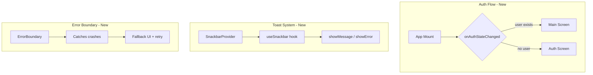

# Course Quest Improvements Implementation Plan

## Architecture Overview




---

## Phase 1: Critical Fixes

### 1.1 Auth State Persistence and Routing

**Problem:** App always shows Auth screen on launch; logged-in users must sign in again every time.

**Solution:** Add `onAuthStateChanged` listener and conditionally render Auth vs Main based on auth state.

**Files to modify:**

- [App.js](App.js): Refactor to use auth state for routing
  - Import `onAuthStateChanged` from `firebase/auth` and `auth` from firebaseConfig
  - Add state: `const [user, setUser] = useState(null)` and `const [loading, setLoading] = useState(true)`
  - Add `useEffect` with `onAuthStateChanged(auth, (user) => { setUser(user); setLoading(false); })`
  - Replace static screen order with conditional initial route:
    - If `loading`: render `ActivityIndicator` (full-screen)
    - If `user`: render `NativeStack.Navigator` with `initialRouteName="Main"`
    - Else: render navigator with `initialRouteName="Auth"`
  - Use `screenOptions` with `initialRouteName` derived from `user`
  - On logout (SettingsScreen), `signOut` already resets auth; the listener will update `user` and the navigator will show Auth

**Navigation flow:** The navigator needs both screens available so that `navigation.replace("Main")` from AuthScreen and `CommonActions.reset` to Auth from SettingsScreen both work. Use a single `NativeStack.Navigator` with `initialRouteName={user ? "Main" : "Auth"}`.

---

### 1.2 Weather API Response Handling

**Problem:** Open-Meteo returns daily values as arrays; code passes arrays to `addRound` instead of scalars. Archive API uses `weathercode` (no underscore) vs forecast's `weather_code`.

**File:** [src/utils/APIController.js](src/utils/APIController.js)

**Changes:**

- Extract first element from each daily array before returning:
  - `temperature: data.daily.temperature_2m_max?.[0] ?? 0`
  - `rain: data.daily.precipitation_sum?.[0] ?? 0`
  - `wind: data.daily.wind_speed_10m_max?.[0] ?? 0`
- Handle both API response shapes for weather code:
  - `weatherCode: data.daily.weather_code?.[0] ?? data.daily.weathercode?.[0] ?? 0`
  - Archive API returns `weathercode`; forecast returns `weather_code`

---

### 1.3 Edit Round Image Upload Logic

**Problem:** `updateRound` re-uploads all images, including existing Firebase URLs, causing duplicates and orphaned storage objects.

**File:** [src/utils/DataController.js](src/utils/DataController.js)

**In `updateRound` function (around lines 378-410):**

- Before calling `uploadImages`, split `images` into:
  - `existingUrls = images.filter(img => typeof img === "string" && img.startsWith("https://"))`
  - `newUris = images.filter(img => !(typeof img === "string" && img.startsWith("https://")))`
- Only upload new URIs:
  - `uploadedUrls = newUris.length > 0 ? await uploadImages(newUris, "rounds", id) : []`
- Combine for final value:
  - `processedImages = [...existingUrls, ...uploadedUrls]`
- Use `processedImages` in the `updateDoc` call

---

### 1.4 Firestore Persistence (Platform-Specific)

**Problem:** `enableIndexedDbPersistence` is web-only; on React Native it fails (IndexedDB unavailable).

**File:** [firebaseConfig.js](firebaseConfig.js)

**Changes:**

- Import `Platform` from react-native (already available)
- Wrap persistence call: only run `enableIndexedDbPersistence(db)` when `Platform.OS === "web"`
- On React Native, skip the call; the app already relies on [DataController.js](src/utils/DataController.js) AsyncStorage cache for offline support

```javascript
if (Platform.OS === "web") {
  enableIndexedDbPersistence(db).catch((err) => { ... });
}
```

---

### 1.5 App Config Cleanup

**File:** [app.json](app.json)

**Changes:**

- Remove duplicate permission: change `"permissions": ["android.permission.RECORD_AUDIO", "android.permission.RECORD_AUDIO"]` to `["android.permission.RECORD_AUDIO"]`
- Add a clear comment/TODO for bundle identifiers: document that `com.yourusername.coursequest` must be replaced with a real bundle ID (e.g. `com.jaylonaucoin.coursequest`) before app store submission
- Do not change the actual bundle ID in the plan; user will provide when ready to publish

---

## Phase 2: Toast/Snackbar System

### 2.1 Create Snackbar Provider and Hook

**New file:** `src/utils/SnackbarProvider.js`

- Create React context for Snackbar state (visible, message, type: "default" | "error" | "success")
- Use React Native Paper's `Snackbar` and `Portal`
- Provider methods: `showMessage(message)`, `showError(message)` — set state to display Snackbar
- Wrap children with `PaperProvider` or ensure it is above the provider in the tree
- Duration: 3 seconds for success/default, 5 seconds for error

**New file:** `src/hooks/useSnackbar.js`

- Export `useSnackbar()` that returns `{ showMessage, showError }` from context
- Throw if used outside provider

**Integration:**

- Add `SnackbarProvider` in [ThemeProvider.js](src/utils/ThemeProvider.js) (or App.js), wrapping `PaperProvider` children so Snackbar is available app-wide

---

### 2.2 Replace alert() with Snackbar

Replace all `alert()` calls with `useSnackbar().showMessage` or `showError`:


| File                                                 | Usage                                             | Replacement                                                                   |
| ---------------------------------------------------- | ------------------------------------------------- | ----------------------------------------------------------------------------- |
| [DataController.js](src/utils/DataController.js)     | Permission denied                                 | `showError` (requires passing callback or making pickImage accept a toast fn) |
| [AddRoundScreen.js](src/screens/AddRoundScreen.js)   | Validation, API errors, add round error           | `showError` for errors; `showMessage` for info                                |
| [EditRoundScreen.js](src/screens/EditRoundScreen.js) | Validation, API errors, update error              | Same pattern                                                                  |
| [AuthScreen.js](src/screens/AuthScreen.js)           | Password reset sent                               | `showMessage`                                                                 |
| [SettingsScreen.js](src/screens/SettingsScreen.js)   | Success/error for email, password, delete, verify | `showMessage` / `showError`                                                   |


**DataController constraint:** `pickImage` is a utility with no hook access. Options:

- Add optional `onError` callback: `pickImage(upload = false, { onError })` and call it when permission denied
- Or have the caller pass `showError` from a wrapper that uses the hook
- Preferred: add optional `onError` in `pickImage`; AddRoundScreen/EditRoundScreen/DataController callers pass `onError: () => showError("...")`

---

## Phase 3: Delete Confirmation

### 3.1 Reusable ConfirmDialog Component

**New file:** `src/components/ConfirmDialog.js`

- Props: `visible`, `onDismiss`, `onConfirm`, `title`, `message`, `confirmLabel` (default "Delete"), `confirmColor` (default error for destructive actions)
- Use React Native Paper `Dialog`, `Dialog.Title`, `Dialog.Content`, `Dialog.Actions`
- Cancel and Confirm buttons; call `onConfirm` then `onDismiss` on confirm

### 3.2 Integrate in HomeScreen and RoundScreen

**Files:** [HomeScreen.js](src/screens/HomeScreen.js), [RoundScreen.js](src/screens/RoundScreen.js)

- Add state: `deleteDialogVisible`, `roundToDelete` (id to delete)
- Change `deleteDBRound(id)` to open dialog: `setRoundToDelete(id); setDeleteDialogVisible(true)`
- Dialog `onConfirm`: call `deleteRound(roundToDelete)`, refresh rounds, clear `roundToDelete`, close dialog
- Dialog `onDismiss`: clear `roundToDelete`, close dialog

---

## Phase 4: Map Tooltip Units

**File:** [src/screens/MapScreen.js](src/screens/MapScreen.js)

- Add `const [units, setUnits] = useState(null)` 
- In `loadRounds` (or a `useEffect`), call `getUnits()` and `setUnits`
- Import `convertTemperature`, `convertWindSpeed`, `convertPrecipitation`, `formatValueWithPrecision` from [UnitConverter.js](src/utils/UnitConverter.js)
- In `renderMarkerInfo`, convert and format based on `units` before display:
  - temp: convert per `units[0]` (celsius/fahrenheit), format with `formatValueWithPrecision`
  - wind: convert per `units[1]` (kilometers/miles), format
  - rain: convert per `units[2]` (millimeters/inches), format
  - Unit labels: `°C`/`°F`, `km/h`/`mph`, `mm`/`in` based on units
- Pass `units` into `renderMarkerInfo`; if units not loaded, show raw values with metric labels as fallback

---

## Phase 5: Error Boundary

### 5.1 Create ErrorBoundary Component

**New file:** `src/components/ErrorBoundary.js`

- Class component with `state = { hasError: false }`
- `static getDerivedStateFromError` → return `{ hasError: true }`
- `componentDidCatch(error, errorInfo)` → `console.error` (optionally prepare for future error reporting)
- Render: if `hasError`, show fallback UI (centered message, "Something went wrong", Retry button that `setState({ hasError: false })`)
- Otherwise render `this.props.children`

### 5.2 Wrap App

**File:** [App.js](App.js)

- Wrap the `ThemeProvider` subtree with `ErrorBoundary`

---

## Phase 6: User-Facing Error Handling

**Problem:** Some errors only `console.error`; user sees no feedback.

**Files to update:**

- [HomeScreen.js](src/screens/HomeScreen.js) — in `fetchRounds` catch block: call `showError("Could not load rounds. Pull to try again.")` via `useSnackbar`
- [RoundScreen.js](src/screens/RoundScreen.js) — same pattern in `fetchRounds` catch
- [MapScreen.js](src/screens/MapScreen.js) — in `loadRounds` catch: `showError("Could not load map data.")` (MapScreen will need SnackbarProvider in tree; if MapScreen is under ThemeProvider, it can use useSnackbar once provider is added)

---

## Implementation Order

Recommended sequence to minimize rework and conflicts:

1. **SnackbarProvider + useSnackbar** — Foundation for all alert replacements and error messages
2. **Auth state routing** — Critical UX fix
3. **Weather API fix** — Quick, isolated change
4. **Edit round image logic** — Isolated data layer fix
5. **Firestore persistence** — Config-only
6. **App config** — Quick cleanup
7. **ConfirmDialog + delete confirmation** — Uses no new dependencies
8. **Replace alert()** — After SnackbarProvider is in place
9. **Map tooltip units** — Self-contained
10. **Error boundary** — Wrap last
11. **User-facing errors in fetchRounds/loadRounds** — After Snackbar is available

---

## Testing Checklist

- Cold start: logged-in user goes to Main without seeing Auth
- Logout: user returns to Auth
- Add round with date in past: weather values are numbers, not NaN
- Edit round with existing images: no duplicate uploads
- Delete round: confirmation dialog appears; cancel does nothing; confirm deletes
- Validation errors: Snackbar appears instead of alert
- Map callouts: values match user unit preferences
- Simulate crash (e.g. throw in render): Error boundary shows fallback and Retry works
- Fetch failure (e.g. airplane mode): user sees Snackbar error

